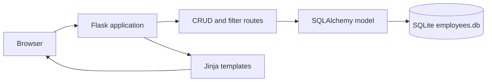

# HR CRM App

A lightweight Arabic-friendly **Human Resources CRUD application** built with Flask and SQLite. The project demonstrates how to build a small server-rendered business application for managing employee records, filtering by department, and performing common record operations.

## Features

| Feature | Description |
|---|---|
| Create employees | Add an employee with name, email, department, and job title. |
| List employees | Display the employee records in a simple responsive interface. |
| Update employees | Edit an existing employee record. |
| Delete employees | Remove an employee record from the database. |
| Department filtering | Filter the employee list by department. |
| Arabic interface | Uses Arabic labels and supports right-to-left content in the UI. |

## Technology Stack

- Python 3.8+
- Flask
- Flask-SQLAlchemy
- SQLite
- Jinja templates
- HTML and CSS

## Application Flow



## Project Structure

```text
hr-crm-app/
├── app.py
├── templates/
│   ├── base.html
│   ├── index.html
│   ├── employees.html
│   └── edit_employee.html
├── static/
│   └── style.css
├── instance/
│   └── employees.db        # Local development database; do not commit production data
└── README.md
```

## Implemented Routes

| Route | Method | Purpose |
|---|---|---|
| `/` | GET | Displays the home page. |
| `/employees` | GET | Lists employees. |
| `/add` | POST | Creates a new employee. |
| `/edit/<id>` | GET/POST | Displays and updates an employee. |
| `/delete/<id>` | POST | Deletes an employee. |
| `/filter` | GET/POST | Filters employees by department. |

## Run Locally

### 1. Clone the repository

```bash
git clone https://github.com/Fatoomnoour/hr-crm-app.git
cd hr-crm-app
```

### 2. Create and activate a virtual environment

Linux/macOS:

```bash
python3 -m venv .venv
source .venv/bin/activate
```

Windows PowerShell:

```powershell
py -m venv .venv
.venv\Scripts\Activate.ps1
```

### 3. Install dependencies

Create a `requirements.txt` containing the project dependencies if it is not already present, then run:

```bash
pip install Flask Flask-SQLAlchemy
```

### 4. Start the application

```bash
python app.py
```

Open `http://127.0.0.1:5000` in your browser.

The SQLite database is created in the application instance directory when the application initializes the database. Use test data locally and do not commit personal employee information.

## Configuration and Security

The current code is a learning/demo implementation. Before production use, move the Flask `SECRET_KEY` to an environment variable, disable `debug=True`, validate and sanitize all form inputs, add CSRF protection, and configure authentication and authorization. The committed `instance/employees.db` file should be reviewed and removed from version control if it contains real or unnecessary data.

Example production-style configuration:

```python
import os

app.config["SECRET_KEY"] = os.environ["SECRET_KEY"]
app.config["SQLALCHEMY_DATABASE_URI"] = os.getenv(
    "DATABASE_URL",
    "sqlite:///employees.db",
)
```

## Testing Status

Automated tests are not currently documented in the repository. A production-ready extension should add tests for employee creation, validation, filtering, editing, deletion, unauthorized access, and database initialization.

## Limitations

The project is a compact educational CRUD application. It currently does not provide authentication, role-based access control, audit logging, CSRF protection, production database migrations, pagination, or a tested deployment configuration. It should not be used to store real employee data without implementing these controls.

## Roadmap

Potential next steps include adding Flask-Migrate, authentication with roles, server-side validation, CSRF protection, PostgreSQL support, automated tests, Docker packaging, and CI checks.

## Author

**Fatma Nour** — [GitHub](https://github.com/Fatoomnoour)
